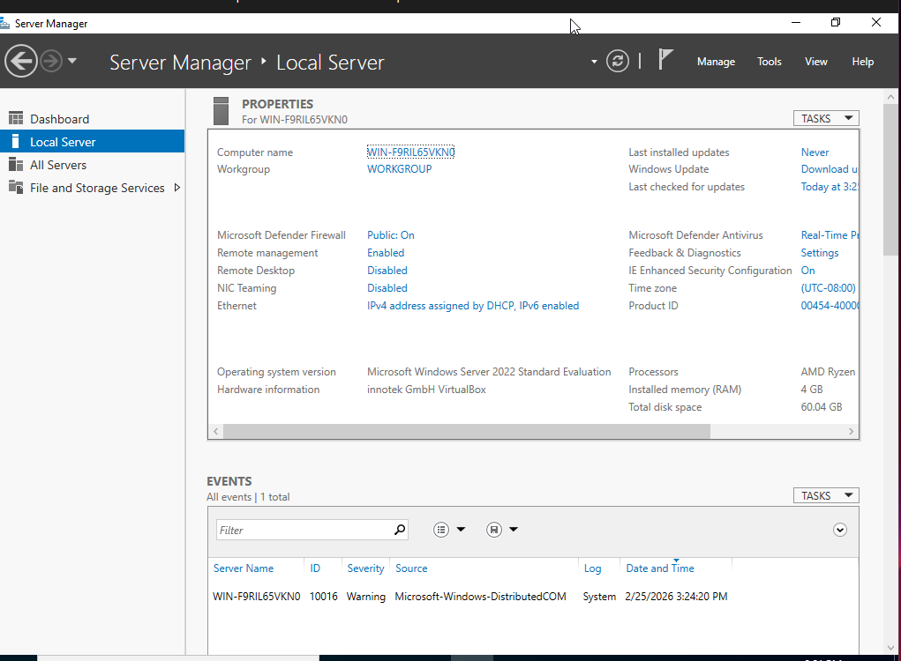
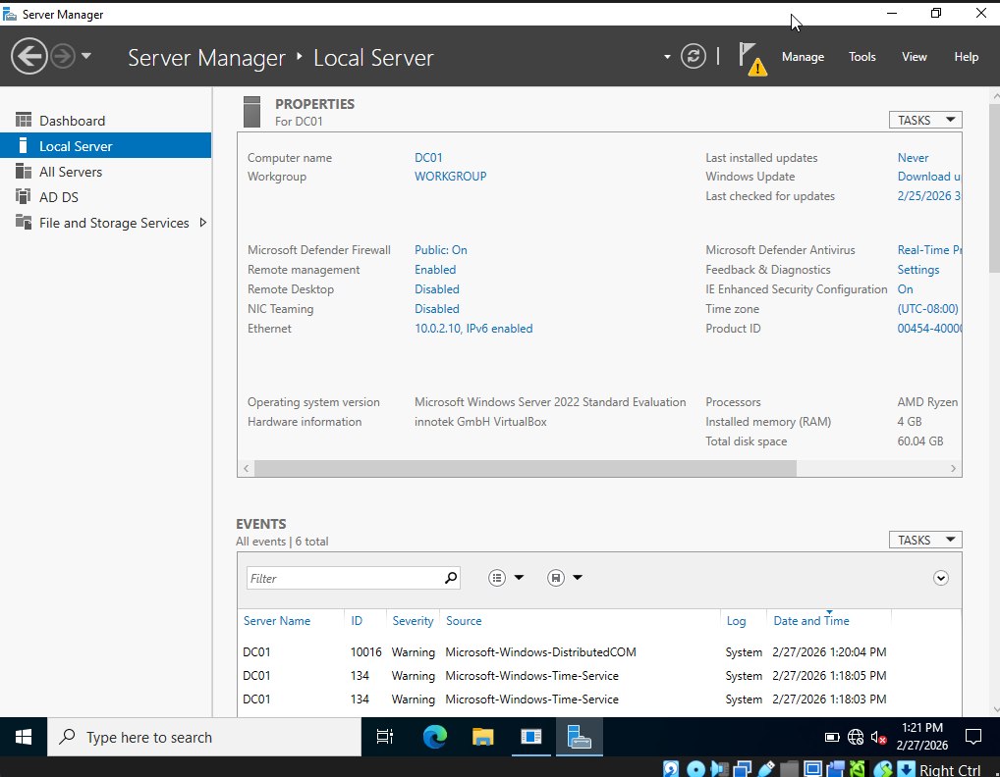
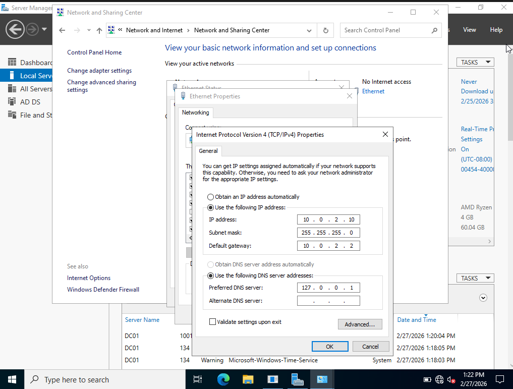

# Part 1 – Environment Setup

## Overview
This phase covers the initial preparation of the Windows Server 2022 virtual machine before Active Directory deployment. This includes OS installation, server renaming, and static IP configuration.

## Lab Environment

| Component | Value |
|---|---|
| Hypervisor | VirtualBox |
| Operating System | Windows Server 2022 Standard Evaluation |
| CPU | AMD Ryzen |
| RAM | 4 GB |
| Disk | 60 GB |
| Network | NAT |

## Steps Performed

### 1. Windows Server 2022 Installation
Installed Windows Server 2022 Standard Evaluation on a VirtualBox virtual machine and completed the initial setup.

**Result:** Successfully logged in as the local Administrator account.

---

### 2. Server Rename
Renamed the server from the default hostname to **DC01** to reflect its future role as the Domain Controller.

**How to rename:**  
Server Manager → Local Server → Computer Name → Change

**Result:** Server name updated to **DC01** after restart.

---

### 3. Static IP Configuration
Assigned a static IPv4 address to ensure a consistent network identity, which is required for a Domain Controller.

## Network Configuration

| Setting | Value |
|---|---|
| IP Address | 10.0.2.10 |
| Subnet Mask | 255.255.255.0 |
| Default Gateway | 10.0.2.2 |
| Preferred DNS | 127.0.0.1 |

**Note:** DNS is set to **127.0.0.1** because this server will host its own DNS service after AD DS promotion. This is standard practice for a Domain Controller in a lab environment.

**How to set static IP:**  
Server Manager → Local Server → Ethernet → Right-click adapter → Properties → IPv4 Properties

## Result
At the end of this phase, the server was:

- Running Windows Server 2022
- Renamed to **DC01**
- Configured with a static IP address (**10.0.2.10**)
- Configured to use itself for DNS (**127.0.0.1**)
- Ready for Active Directory Domain Services installation
