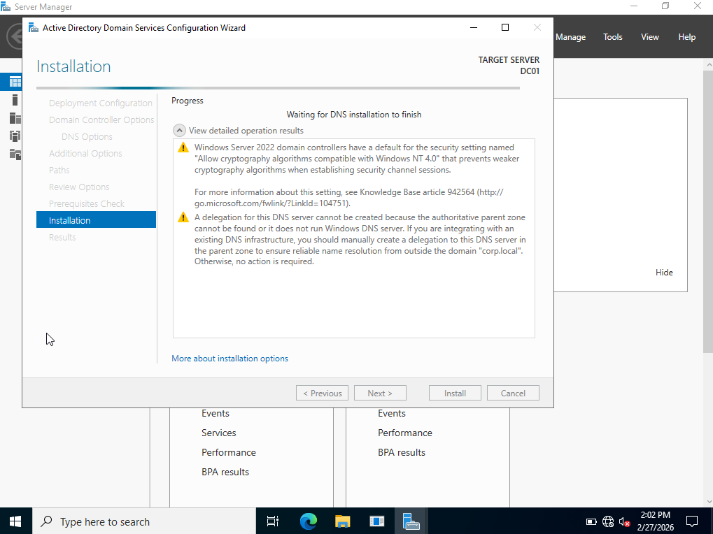
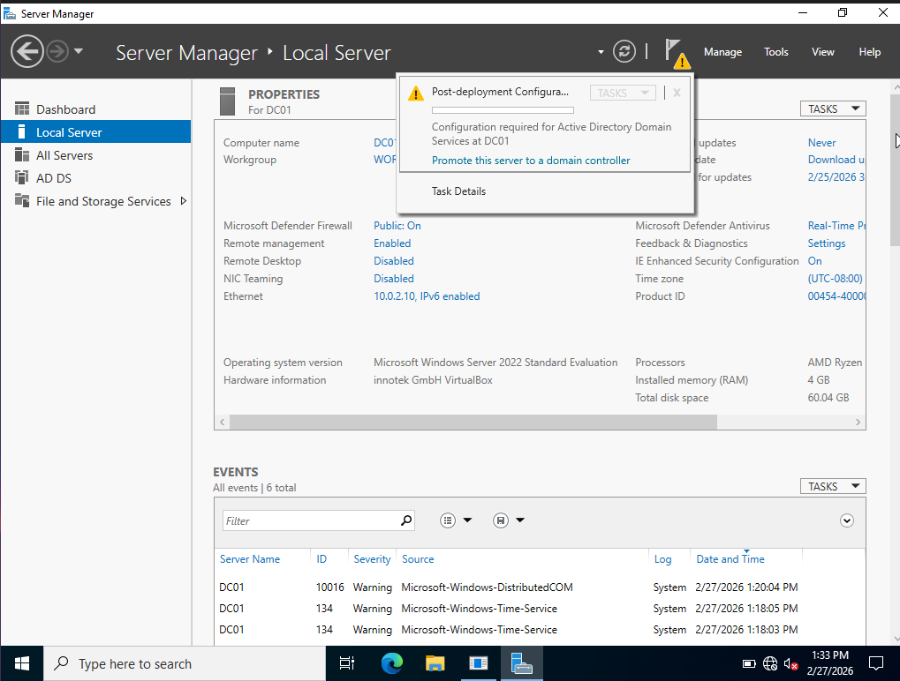

# Part 2 – Domain Deployment

## Overview
This phase covers the installation of Active Directory Domain Services (AD DS) and the promotion of **DC01** to a Domain Controller for the **corp.local** domain.

## Steps Performed

### 1. Install AD DS Role
Opened Server Manager and added the **Active Directory Domain Services** role through the Add Roles and Features Wizard.

The DNS Server role was also installed as part of the deployment, which is required for AD DS functionality.

**How to install the role:**  
Server Manager → Manage → Add Roles and Features → Role-based installation → Select **Active Directory Domain Services** → Install

---

### 2. Post-Deployment Configuration
After the role installation completed, Server Manager displayed a notification indicating that additional configuration was required.

Selected **Promote this server to a domain controller** to launch the AD DS Configuration Wizard.

---

### 3. Domain Promotion Summary
The server was promoted using the following configuration:

- Deployment type: **Add a new forest**
- Root domain name: **corp.local**
- DNS Server: Enabled
- Global Catalog (GC): Enabled
- NetBIOS name: **CORP**
- Directory Services Restore Mode (DSRM) password configured
- Default database, log, and SYSVOL paths accepted

## DNS Warning Explanation
During promotion, a delegation warning may appear because this is an isolated lab environment with no parent DNS zone.

This is expected and does not affect the functionality of the lab.

## Result
At the end of this phase:

- AD DS role was installed on **DC01**
- **DC01** was promoted to a Domain Controller
- A new forest was created: **corp.local**
- DNS Server was installed and integrated with Active Directory
- The server restarted successfully and was accessible as **CORP\\Administrator**
