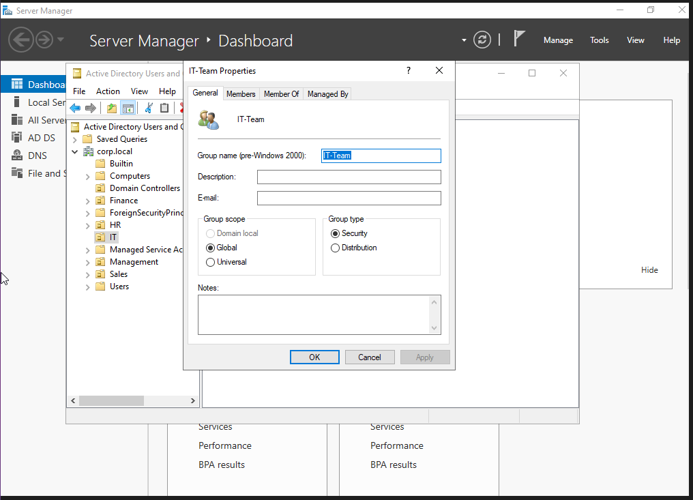
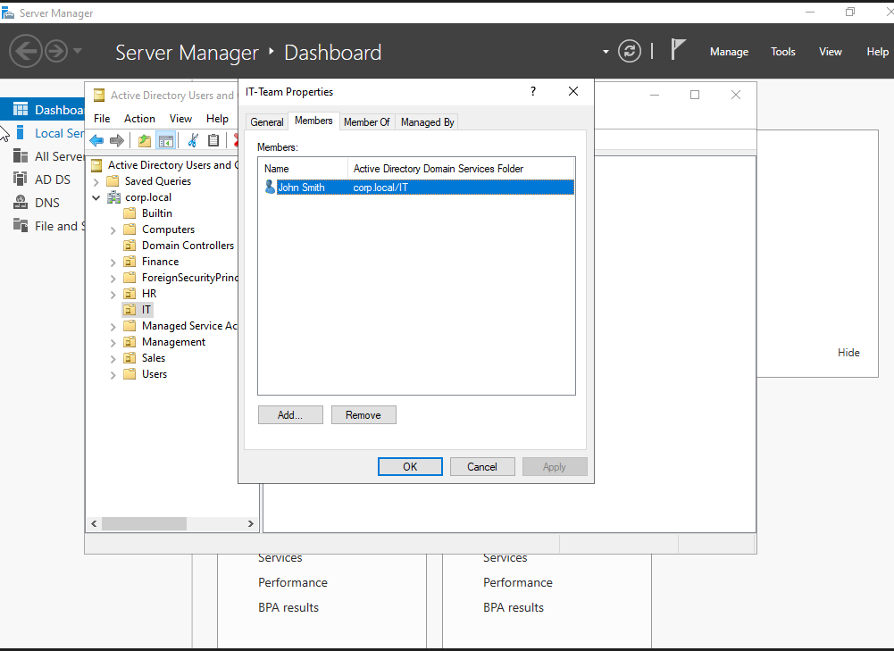
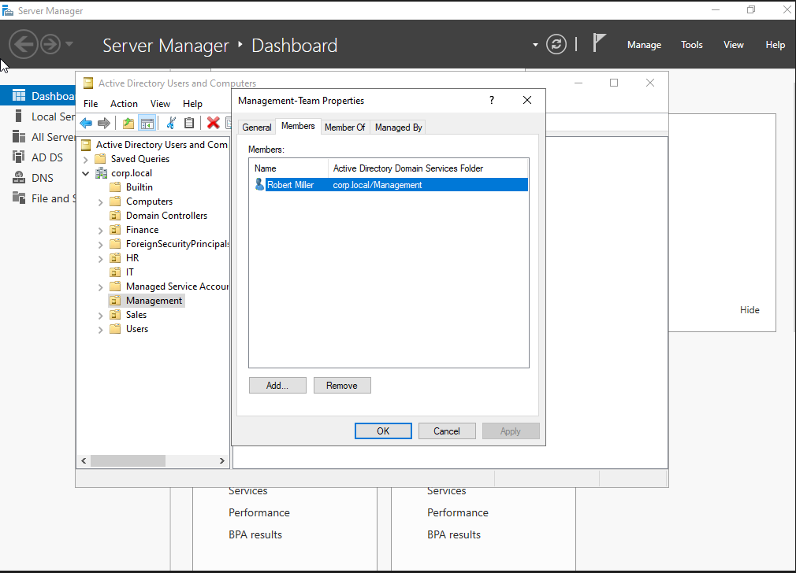
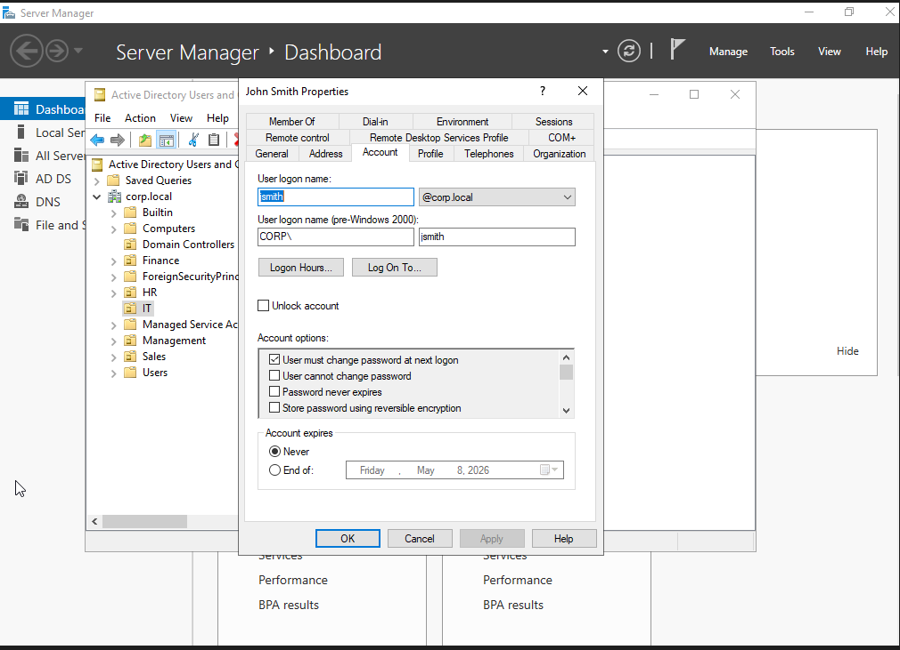
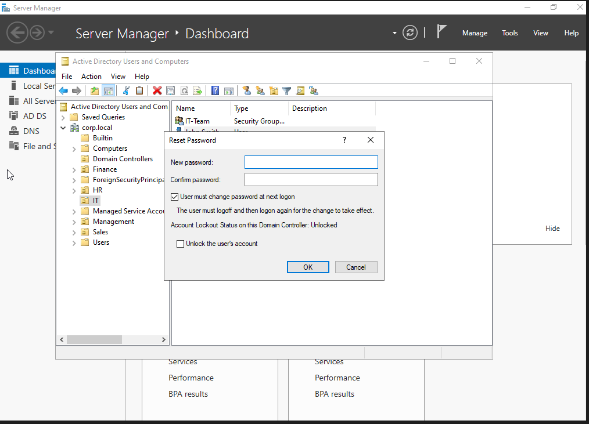
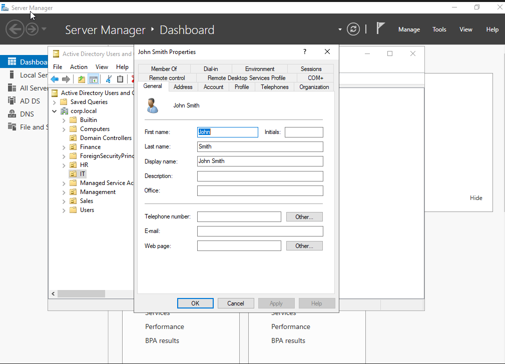

# Part 3 – Active Directory User and Group Management

## Objective
The goal of this phase was to practice common identity and access management tasks in Active Directory that are frequently handled by Help Desk and junior system administrators.

## Tasks Performed
In this section of the lab, I used **Active Directory Users and Computers (ADUC)** to perform the following administrative tasks:

- Created and reviewed user accounts
- Configured account settings for domain users
- Created security groups for departmental access control
- Added users to the appropriate security groups
- Reset user passwords
- Organized objects by department using Active Directory containers/OUs

## Key Actions Completed

### 1. Created security groups for department-based access
I created security groups such as **IT-Team** and **Management-Team** to simulate role-based access control inside the domain.

This reflects how organizations assign permissions through groups instead of managing access one user at a time.

### 2. Added users to the correct groups
I assigned users to the appropriate departmental groups:
- **John Smith** was added to **IT-Team**
- **Robert Miller** was added to **Management-Team**

This demonstrates group-based administration and basic access management in a Windows domain environment.

### 3. Reviewed and configured user account properties
I inspected user account settings in the **Account** tab for domain users.

This included reviewing:
- user logon name
- pre-Windows 2000 logon name
- password change requirements
- password expiration options
- account expiration settings
- account lock/unlock options

This is a common Help Desk task when provisioning or troubleshooting user accounts.

### 4. Performed password reset
I used the **Reset Password** option for a domain user and verified the available administrative options, including:
- forcing password change at next logon
- unlocking the account if necessary

This simulates a real-world support workflow for assisting end users who are locked out or need credential resets.

## Skills Demonstrated

- Active Directory user management
- Security group creation and membership management
- Account property review and configuration
- Password reset administration
- Basic role-based access control (RBAC)
- Administrative navigation in Active Directory Users and Computers

## Screenshots

### 1. Security group creation – IT-Team

### 2. IT-Team group membership

### 3. Management-Team group membership

### 4. User account properties

### 5. Password reset workflow

### 6. User general properties

## What I Learned
This phase reinforced an important Active Directory principle:
**access should be managed through groups, not by assigning permissions directly to individual users whenever possible.**

It also gave me hands-on practice with routine administrative tasks that are highly relevant for Help Desk, IT Support, and junior system administration roles.
